# 4DPop Git — Guide utilisateur

4DPop Git permet d'utiliser Git depuis 4D, sans passer par le Terminal pour les opérations courantes : consulter les modifications, préparer un commit, synchroniser le dépôt et naviguer dans l'historique.

Le composant est destiné aux **projets 4D**. Il exploite les fichiers du projet et leur historique ; Git n'apporte pas d'intérêt pour une base binaire `.4db` ou `.4dc`, dont la structure n'est pas gérée comme un ensemble de fichiers projet.

Ce guide décrit l'utilisation du composant dans un projet 4D. Il s'adresse aux développeurs qui connaissent les principes de base de Git, mais pas nécessairement ses commandes.

## 1. Conditions préalables

### Git

Git doit être installé sur la machine :

- macOS : Git est fourni avec Xcode. Il peut aussi être installé depuis [git-scm.com](https://git-scm.com/download/mac).
- Windows : installez Git depuis [git-scm.com](https://git-scm.com/download/win).

Le composant utilise l'installation locale de Git pour lire et modifier le dépôt du projet.

### GitHub CLI

La fonction **Publier sur GitHub** utilise la commande `gh`. Le composant fournit un exécutable de secours, mais l'installation de [GitHub CLI](https://cli.github.com/) reste recommandée.

## 2. Installation dans un projet 4D

### Projet avec gestion des dépendances

Avec 4D v21 ou une version ultérieure :

1. Ouvrez le projet dans 4D.
2. Ouvrez le gestionnaire des dépendances.
3. Ajoutez une dépendance GitHub.
4. Saisissez `vdelachaux/4DPop-Git`.
5. Sélectionnez la version souhaitée, par exemple `latest`.
6. Appliquez les modifications.
7. Redémarrez le projet si 4D le demande.

## 3. Ouvrir 4DPop Git

Ouvrez l'entrée **Git** dans 4DPop. Le composant affiche le dépôt correspondant au projet courant.

Si le projet n'est pas encore un dépôt Git, le widget propose de l'initialiser. Cette opération crée le dossier `.git` dans le dossier du projet. Elle ne crée pas automatiquement de dépôt distant.

### Le widget dans la réglette 4DPop

Le widget Git reste visible dans la réglette 4DPop et donne un aperçu rapide de l'état du dépôt du projet courant.

De haut en bas :

- **Icône Git** : ouvre la fenêtre principale de 4DPop Git.
- **Branche courante** : affiche ici `main`. Cliquez dessus pour afficher les branches disponibles et changer de branche. Le nom peut apparaître en rouge lorsque la branche ne correspond pas à la version de 4D attendue par le projet.
- **Modifications locales** : le nombre situé à côté de l'icône de changements indique les fichiers modifiés dans le répertoire de travail. Cliquez dessus pour afficher la liste des fichiers concernés et accéder directement aux actions sur ces fichiers.
- **À récupérer** : le nombre situé à gauche des flèches indique le nombre de commits disponibles sur le dépôt distant et qui ne sont pas encore présents localement.
- **À envoyer** : le nombre situé à droite des flèches indique le nombre de commits locaux qui n'ont pas encore été envoyés vers le dépôt distant.
- **Étiquettes TODO et FIXME** : lorsqu'elles sont présentes, ces icônes donnent accès aux méthodes contenant les marqueurs correspondants.
- **Menu `…`** : donne accès au gestionnaire du dépôt, à la création d'un snapshot, à l'ouverture du projet dans le Terminal ou sur le disque, à la page GitHub du dépôt, à l'actualisation et aux paramètres.

Lorsque le projet courant n'est pas encore un dépôt Git, le widget remplace ces informations par l'action **Cliquer pour initialiser le dépôt git**.

### La fenêtre principale

La fenêtre principale contient deux pages :

- **Changements** : fichiers modifiés, index Git, différence du fichier sélectionné et création de commit.
- **Historique** : commits, graphique des branches et détail du commit sélectionné.

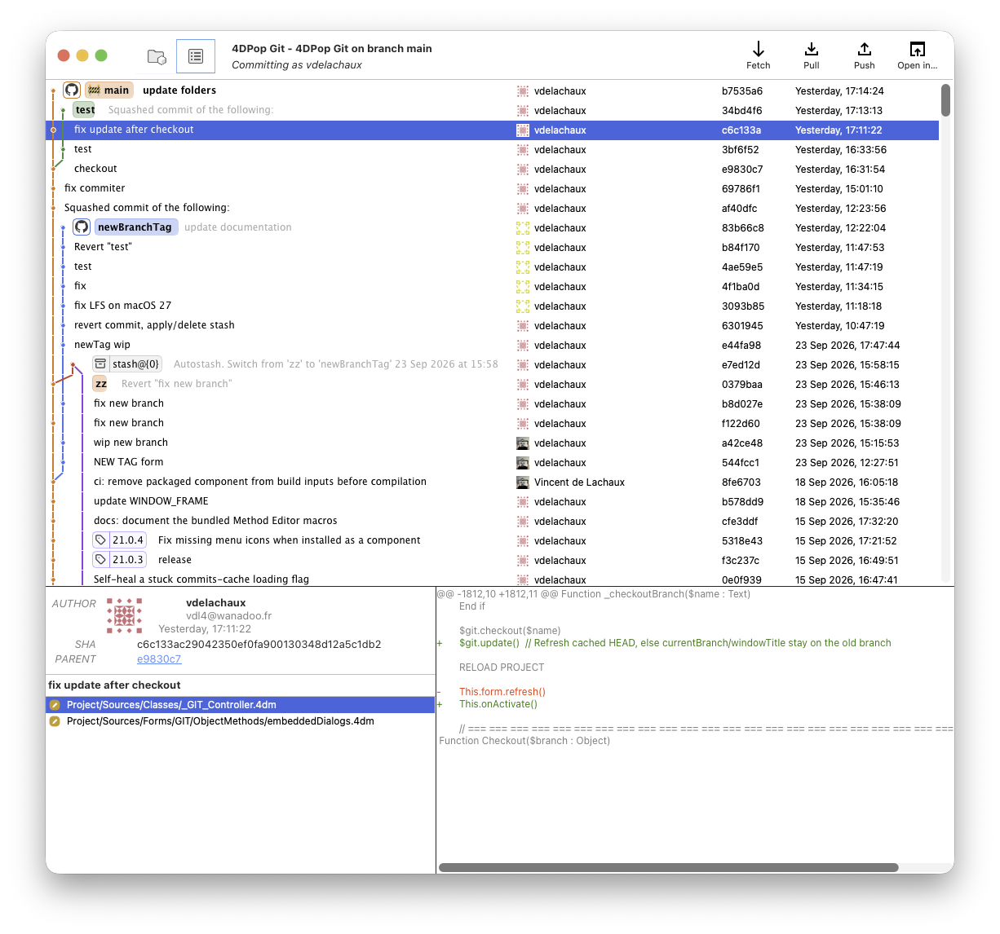

La branche courante et les indicateurs de synchronisation sont visibles dans le widget 4DPop. Les actions rapides permettent notamment de consulter les changements, changer de branche, récupérer les nouveautés distantes et envoyer les commits.

## 4. Préparer et créer un commit

### Comprendre les deux listes

Dans la page **Changements** :

- **Changements locaux** contient les fichiers modifiés mais pas encore préparés pour le prochain commit.
- **Index** contient les fichiers qui seront inclus dans le prochain commit.
- Le panneau de droite affiche la différence du fichier sélectionné.

Cette séparation correspond au fonctionnement de Git : un fichier peut être modifié localement sans être encore sélectionné pour le commit.

### Ajouter des fichiers à l'index

1. Sélectionnez un ou plusieurs fichiers dans **Changements locaux**.
2. Cliquez sur le bouton d'ajout à l'index.
3. Vérifiez que les fichiers apparaissent dans **Index**.
4. Pour retirer un fichier de l'index, sélectionnez-le dans **Index** et cliquez sur le bouton de retrait.

Lorsque rien n'est sélectionné, le bouton agit sur tous les fichiers de la liste concernée.

Le menu d'un fichier permet également de l'éditer, de l'afficher dans le Finder ou, pour un changement local, d'abandonner la modification ou de supprimer le fichier local. Il permet aussi de lancer la comparaison externe, de copier le chemin, d'ajouter le fichier à l'index ou de l'ignorer.

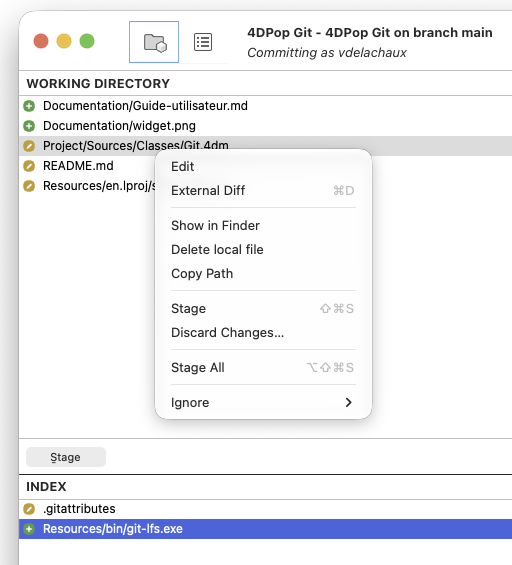

> L'abandon d'une modification supprime les changements locaux du fichier. Vérifiez la différence avant de confirmer cette opération.

Lorsqu'un fichier doit être ignoré, le sous-menu **Ignore** permet d'ajouter un pattern au fichier `.gitignore`. Le pattern peut être vérifié dans un aperçu avant validation.

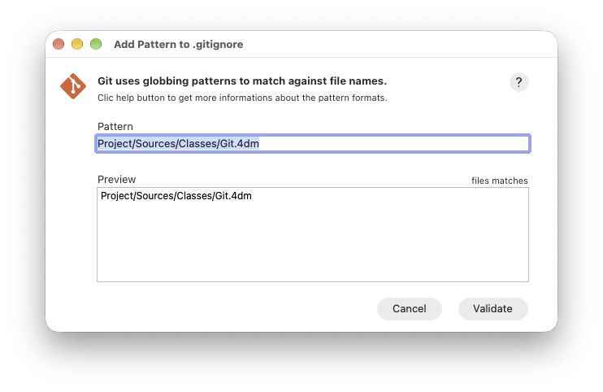

### Créer le commit

1. Ajoutez à l'index les fichiers à enregistrer.
2. Saisissez un sujet court dans le champ du commit.
3. Ajoutez éventuellement une description plus détaillée.
4. Cliquez sur **Commit**.

Un commit ne contient que les fichiers présents dans l'index. Les autres modifications restent dans le dossier de travail et pourront être incluses dans un commit ultérieur.

### Modifier le dernier commit

Activez **Modifier le dernier commit** lorsque vous voulez remplacer le dernier commit par un nouveau commit, par exemple après avoir oublié un fichier ou corrigé son message.

Cette option réécrit le dernier commit. Évitez de l'utiliser sur un commit déjà partagé avec d'autres personnes, sauf si votre équipe accepte cette réécriture.

## 5. Consulter l'historique

Ouvrez la page **Historique** pour consulter les commits du dépôt.

Sélectionnez un commit pour afficher :

- son auteur et sa date ;
- son identifiant court et complet ;
- son commit parent ;
- la liste des fichiers modifiés ;
- la différence par rapport au commit parent.

Le chargement de l'historique peut prendre un moment sur un dépôt volumineux. L'actualisation se fait en arrière-plan.

### Comprendre le graphique

Le graphique représente les branches et les fusions sous forme de lignes colorées. Les étiquettes indiquent notamment les branches locales, les branches distantes, les tags et les stashs.

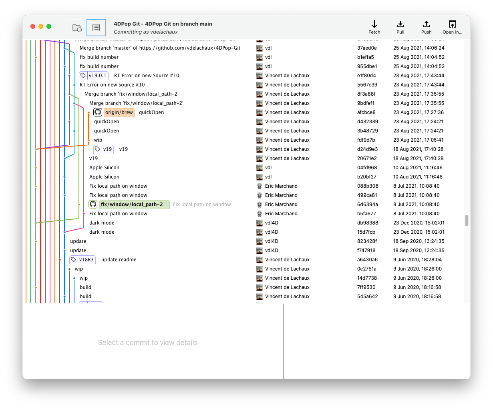

La couleur sert à suivre une ligne dans le graphique ; elle ne représente pas un état particulier du commit.

## 6. Synchroniser avec un dépôt distant

Les boutons **Fetch**, **Pull** et **Push** agissent sur le dépôt distant configuré pour la branche courante.

### Fetch

**Fetch** télécharge les nouvelles références du dépôt distant sans modifier vos fichiers locaux ni fusionner de commit dans la branche courante. Utilisez-le pour consulter l'état distant avant de décider d'un `Pull` ou d'un changement de branche.

### Pull

**Pull** récupère les nouveautés distantes puis les intègre à la branche courante. La boîte de dialogue propose deux modes d'intégration exclusifs :

- **Merge** : utilisé lorsque la case **Rebase** n'est pas cochée ; il crée une fusion lorsque les historiques ont divergé.
- **Rebase** : utilisé lorsque la case **Rebase** est cochée ; il rejoue vos commits locaux au-dessus des commits distants.

L'option **Stash automatique** est indépendante de ces deux modes. Lorsqu'elle est activée, elle met temporairement de côté les modifications locales nécessaires pour effectuer l'opération, puis tente de les restaurer.

Choisissez le mode de fusion utilisé par votre équipe. Si vous ne savez pas lequel choisir, vérifiez la convention du projet avant de lancer l'opération.

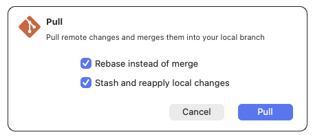

### Push

**Push** envoie les commits locaux vers le dépôt distant.

Si la branche n'a pas encore de dépôt distant, 4DPop Git propose de la publier sur GitHub (voir la section suivante).

L'option **Force-with-lease** permet de réécrire une branche distante tout en vérifiant qu'elle n'a pas été modifiée par quelqu'un d'autre depuis votre dernière récupération. Elle reste réservée aux situations où la réécriture de l'historique est volontaire.

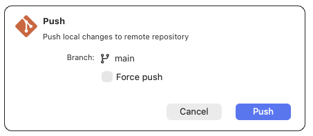

## 7. Branches, tags et stashs

### Changer de branche

Utilisez le menu de branche dans le widget 4DPop ou le menu contextuel d'un commit dans l'historique.

Avant un changement de branche, assurez-vous que vos modifications locales sont :

- commitées ;
- placées dans un stash ;
- ou explicitement conservées par l'option de stash automatique proposée par la boîte de dialogue.

La boîte de dialogue **Checkout** permet de choisir le traitement des modifications locales : ne pas les modifier, les placer dans un stash puis les réappliquer, ou les supprimer.

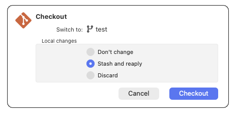

### Créer une branche

Depuis le menu de branche ou le menu contextuel d'un commit :

1. Choisissez **Nouvelle branche**.
2. Saisissez un nom Git valide.
3. Choisissez si la nouvelle branche doit devenir la branche courante immédiatement.
4. Validez.

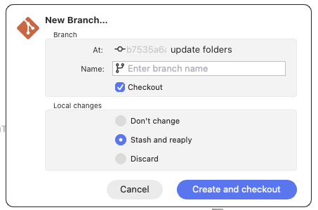

### Tags

Un tag peut être créé depuis un commit de l'historique. Il sert à nommer un état précis du projet, par exemple une version publiée. La boîte de dialogue demande le nom du tag et le commit auquel il doit être attaché.

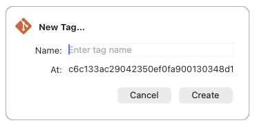

### Stash

Un stash met de côté des modifications locales sans créer de commit. Il est utile avant de changer de branche ou de récupérer des changements distants.

- **Save** enregistre les modifications dans un stash.
- **Snapshot** crée un stash en conservant l'état de travail selon l'option proposée.
- **Pop** réapplique un stash et le retire de la liste s'il est appliqué avec succès.

Les stashs apparaissent également dans le graphique de l'historique.

## 8. Publier le projet sur GitHub

La commande **Publier sur GitHub** est proposée lorsqu'aucun remote n'est configuré pour le dépôt.

Le parcours est le suivant :

1. Ouvrez le menu **Push** ou l'action de publication proposée par le widget.
2. Connectez-vous avec GitHub lorsque GitHub CLI le demande.
3. Suivez le flux d'authentification dans le navigateur.
4. Choisissez les paramètres proposés pour le nouveau dépôt.
5. 4DPop Git crée le dépôt GitHub et envoie les commits locaux.

Aucun jeton GitHub n'a besoin d'être copié manuellement dans 4D.

Une capture dédiée de ce parcours pourrait compléter cette section, en veillant à ne pas afficher d'informations personnelles ni de jeton.

## 9. Macros de l'éditeur de méthodes

L'installation ajoute deux macros au menu contextuel de l'éditeur de méthodes 4D. Elles sont disponibles pendant l'édition d'une méthode ou d'une classe.

### Historique Git d'un fichier

1. Pendant l'édition d'une méthode ou d'une classe, ouvrez le menu contextuel.
2. Dans le menu contextuel, choisissez **Insert macro > Git history…**.
3. Sélectionnez un commit dans la liste pour afficher sa différence.

La fenêtre affiche les commits qui ont modifié ce fichier, y compris les renommages suivis par Git. Une entrée en haut de la liste représente les changements non commités, lorsqu'il y en a.

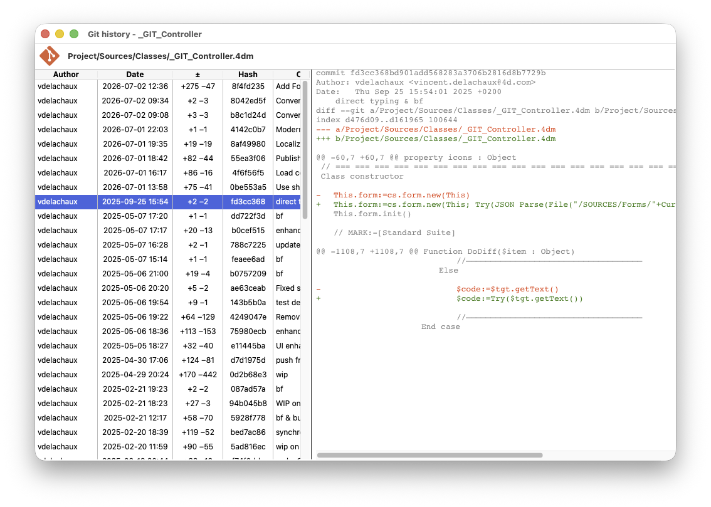

La fenêtre est unique pour chaque fichier : relancer la macro ramène la fenêtre existante au premier plan. Elle se ferme avec l'éditeur de méthodes associé.

### Dernier commit d'une sélection

1. Sélectionnez une ou plusieurs lignes dans l'éditeur de méthode.
2. Dans le menu contextuel, choisissez **Insert macro > Last commit for selection…**.

4DPop Git indique le dernier commit ayant modifié ces lignes, avec son auteur, sa date, son identifiant court et son sujet.

## 10. Ouvrir les outils externes

Le menu **Open in…** permet d'ouvrir le projet ou le fichier sélectionné dans les outils disponibles sur la machine, par exemple le Finder ou un Terminal.

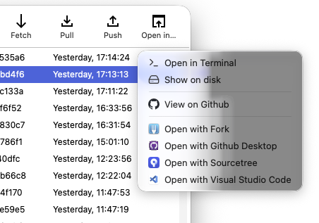

Le menu **Diff tool** peut ouvrir la différence dans l'outil externe configuré dans les préférences du composant.

## 11. Dépannage rapide

### Le composant ne trouve pas Git

Vérifiez que Git est installé et accessible dans le `PATH` de 4D. Redémarrez 4D après l'installation de Git si le composant ne détecte pas immédiatement l'exécutable.

### Le dépôt n'apparaît pas

Vérifiez que le projet courant contient un dossier `.git`. Si nécessaire, utilisez l'action d'initialisation proposée par le widget.

### Push refusé

Consultez d'abord l'historique et utilisez **Fetch** pour mettre à jour les références distantes. Un `Pull` peut être nécessaire avant de relancer le `Push`.

Ne choisissez **Force-with-lease** que si vous devez réellement réécrire l'historique distant.

### La publication GitHub échoue

Vérifiez que GitHub CLI est installé ou que l'exécutable de secours du composant est disponible. Recommencez l'authentification dans le navigateur, puis vérifiez que votre compte possède le droit de créer un dépôt.

## Documentation complémentaire

- [README du composant](../README.md) : installation, aperçu technique et API.
- [Classe Git](Classes/Git.md) : automatisation des commandes Git depuis 4D.
- [Classe gh](Classes/gh.md) : automatisation des opérations GitHub depuis 4D.

## Ressources Git et GitHub

- [Documentation Git](https://git-scm.com/doc) : documentation de référence et ressources d'installation.
- [Livre Pro Git](https://git-scm.com/book/fr/v2) : introduction gratuite aux concepts et flux de travail Git.
- [Documentation GitHub](https://docs.github.com/fr/get-started) : guides sur les dépôts, les branches, les pull requests et la collaboration.
- [Manuel GitHub CLI](https://cli.github.com/manual/) : référence de la commande `gh` utilisée par le parcours de publication sur GitHub.
