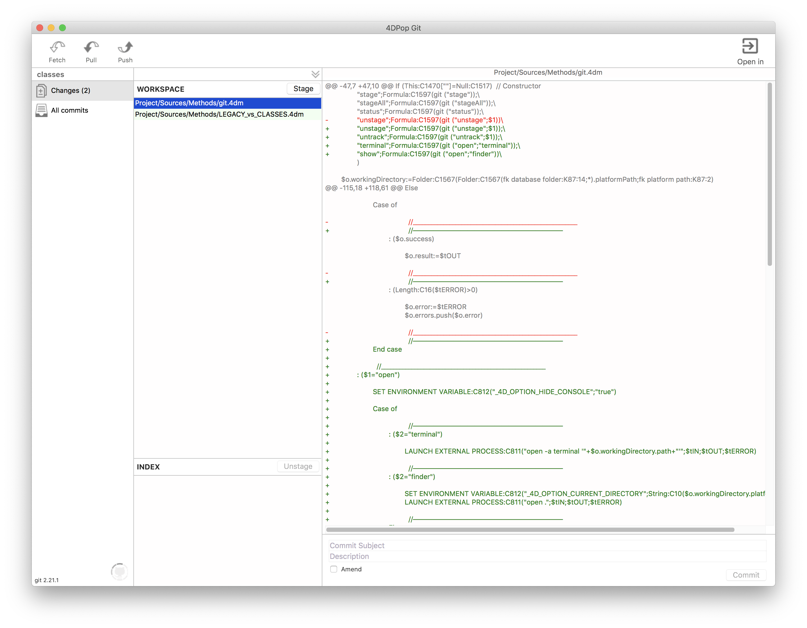
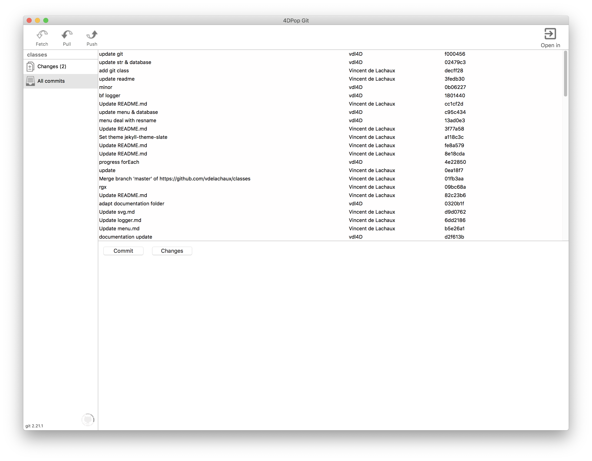
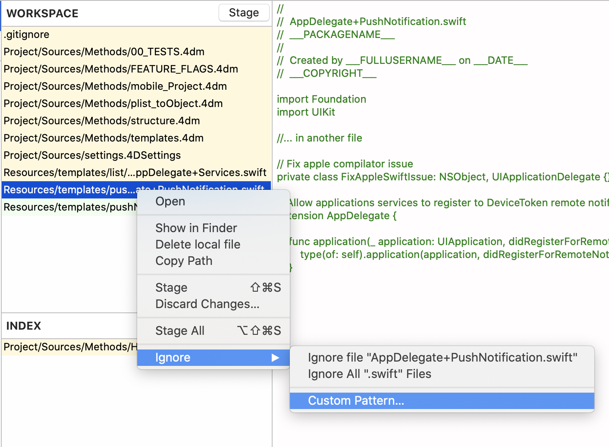
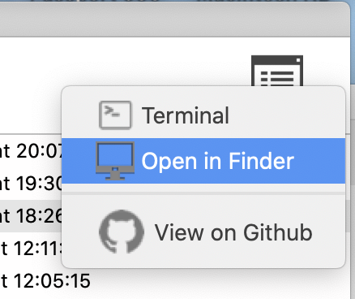

[code-shield]: https://img.shields.io/static/v1?label=language&message=4d&color=blue
[code-url]: https://developer.4d.com/
[license-url]: LICENSE
[notarized]: https://img.shields.io/badge/notarized-blue

[code-top]: https://img.shields.io/github/languages/top/vdelachaux/4DPop-Git.svg
[code-size]: https://img.shields.io/github/languages/code-size/vdelachaux/4DPop-Git.svg
[release-shield]: https://img.shields.io/github/v/release/vdelachaux/4DPop-Git?include_prereleases
[release-url]: https://github.com/vdelachaux/4DPop-Git/releases/latest
[license-shield]: https://img.shields.io/github/license/vdelachaux/4DPop-Git
[build-shield]: https://github.com/vdelachaux/4DPop-Git/actions/workflows/build.yml/badge.svg
[build-url]: https://github.com/vdelachaux/4DPop-Git/actions/workflows/build.yml

[![language][code-shield]][code-url]
[![language-top][code-top]][code-url]
![code-size][code-size]
[![license][license-shield]][license-url] 
[![release][release-shield]][release-url]
[![build][build-shield]][license-url]
![notarized][notarized]

# 4DPop Git

No need to read the <a href="https://git-scm.com/docs/git">**git**</a> command documentation or to be an expert of the Terminal, everything is done automatically for you, just stay focused on your work.

## Git must be installed on your computer

### macOS

Git comes with [Xcode](https://developer.apple.com/xcode/), so there's nothing more to do if this is installed. Otherwise, you can install the latest version of Git from [this page](https://git-scm.com/download/mac).

### Windows
If you have not already done so, Git must be installed from [this page] (https://git-scm.com/download/win).

## Note

The master branch is under development with the main branch of 4D. Thus, some commands or features may not be available in the latest public release and you will not be able to compile or it could generate runtime errors.

**You should always use the branch whose name is the version of your 4D application. ie 18R3 branch with 4D 18R3 for example..**

[Choose the version](https://github.com/vdelachaux/4DPop-Git/branches)

---------- 

