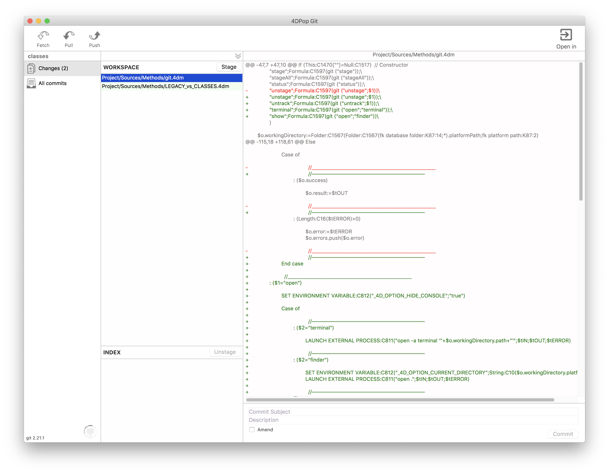
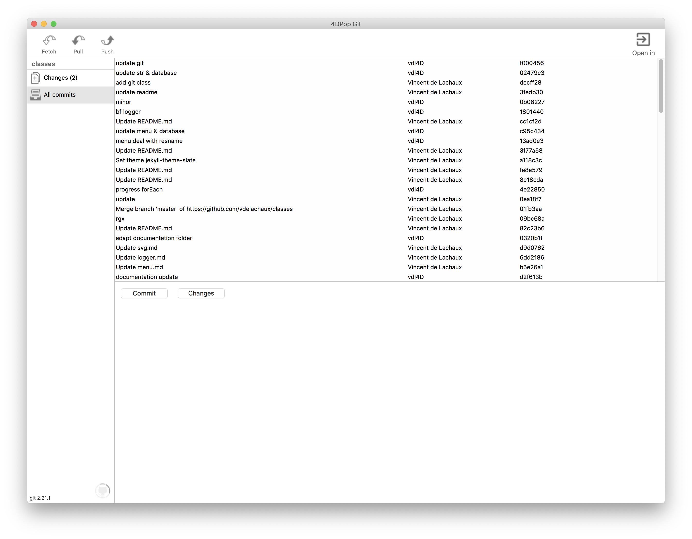
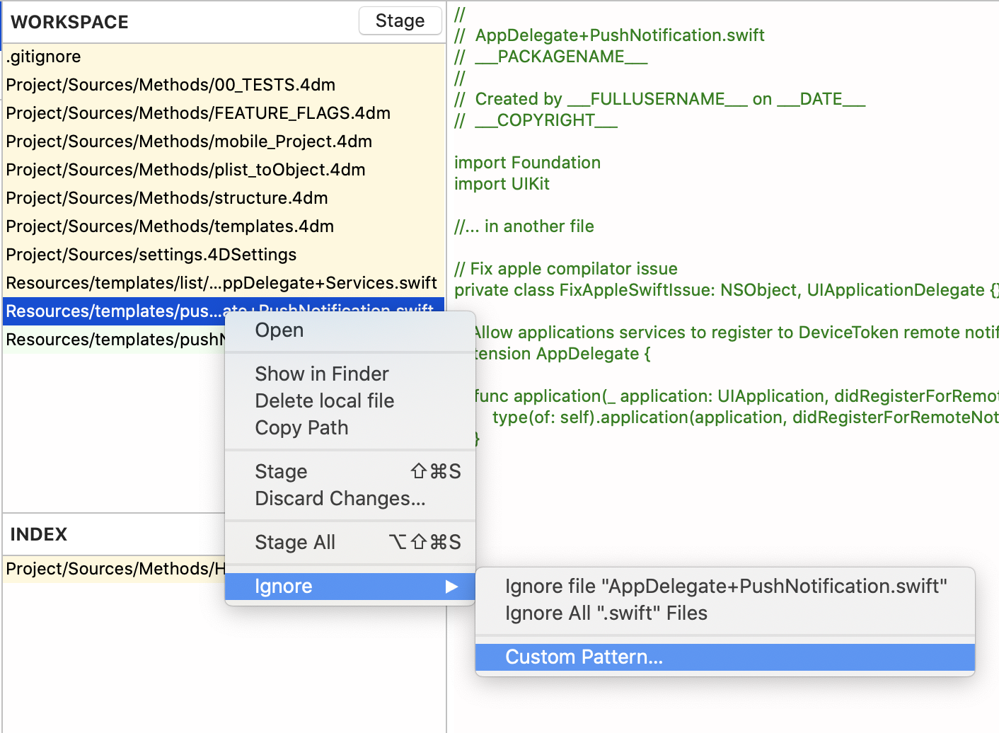
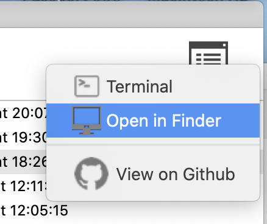

<!-- MARKDOWN LINKS & IMAGES -->
[release-shield]: https://img.shields.io/github/v/release/vdelachaux/4DPop-Git.svg?include_prereleases
[release-url]: https://github.com/vdelachaux/4DPop-Git.svg/releases/latest

[license-shield]: https://img.shields.io/github/license/vdelachaux/4DPop-Git.svg

<!--BADGES-->


<br>
[![release][release-shield]][release-url]
[![license][license-shield]](LICENSE)
<br>


# 4DPop Git

**4DPop Git** brings a friendly, developer-oriented Git interface right inside the 4D IDE.

No need to read the <a href="https://git-scm.com/docs/git">**git**</a> command-line documentation or to be a Terminal expert: everyday operations — stage, commit, branch, fetch, pull, push, stash, diff — are handled for you, so you can stay focused on your work.

It also exposes a scriptable API (the [`Git`](Documentation/Classes/Git.md) and [`gh`](Documentation/Classes/gh.md) classes) so you can automate Git and GitHub tasks from your own code.

## Highlights

- Visual overview of your working copy: pending changes, staged files and history.
- Everyday Git actions in a couple of clicks:
	- Stage / unstage / untrack files
	- Commit (with amend)
	- Fetch, pull and push (with force-with-lease)
	- Branch: create, switch, merge, rename, delete
	- Stash: save, snapshot, pop
	- Diff files with your external diff tool
- Commit history with author avatars (Gravatar) and asynchronous, non-blocking loading.
- **Publish to GitHub** in one step, using the GitHub CLI (`gh`) with device-flow authentication — no manual token handling.
- Git LFS support.
- A scriptable API available to host projects through the `git` namespace.

## Prerequisites: Git must be installed

### macOS

Git ships with [Xcode](https://developer.apple.com/xcode/), so nothing more is needed if it is installed. Otherwise, install the latest version of Git from [this page](https://git-scm.com/download/mac).

### Windows

If you have not already done so, install Git from [this page](https://git-scm.com/download/win).

### Optional: GitHub CLI (for the *Publish to GitHub* feature)

The one-step *Publish to GitHub* flow relies on the [GitHub CLI](https://cli.github.com/). The component embeds a fallback binary, but installing `gh` on your machine is recommended.

## Installation

### Recommended (4D v21+): [Project dependencies](https://developer.4d.com/docs/Project/components/#adding-a-github-or-gitlab-dependency)

Use the 4D Dependencies Manager UI to install the component:

1. Open your project in 4D (v21+).
2. Open the Dependencies Manager.
3. Add a GitHub dependency.
4. Enter the GitHub repository address: `vdelachaux/4DPop-Git`.
5. Choose the version you want (for example `latest`).
6. Apply changes and let 4D update project dependencies.

No manual JSON editing is required.

### Fallback for binary databases or legacy setups

If you are not using project dependencies (for example in older or binary database workflows):

1. Copy `4DPop Git.4dbase` (or create an alias) into the `Components` folder next to your structure.
2. Restart the database.

## Usage

Open the 4DPop **Git** entry to display the main window for the current project's working copy. From there you can review your changes, stage and commit them, and synchronize with your remotes.

### Main window



### Commit history



### File menu



### Open menu



## Scripting API

The component exposes two classes to host projects through the `git` class store namespace:

| Class | Access | Purpose |
|---|---|---|
| [`Git`](Documentation/Classes/Git.md) | `cs.git.Git.me` | Wrapper around the local `git` command line |
| [`gh`](Documentation/Classes/gh.md) | `cs.git.gh.me` | Wrapper around the GitHub CLI (auth, create/delete repositories) |

```4d
var $git : cs.git.Git:=cs.git.Git.me

$git.add("all")
$git.commit("My commit message")
$git.push()
```

See the [class documentation](Documentation/Classes) for the full API.

## Source code

The component is distributed in compiled form, with source code available in the `Sources` folder inside the component.
